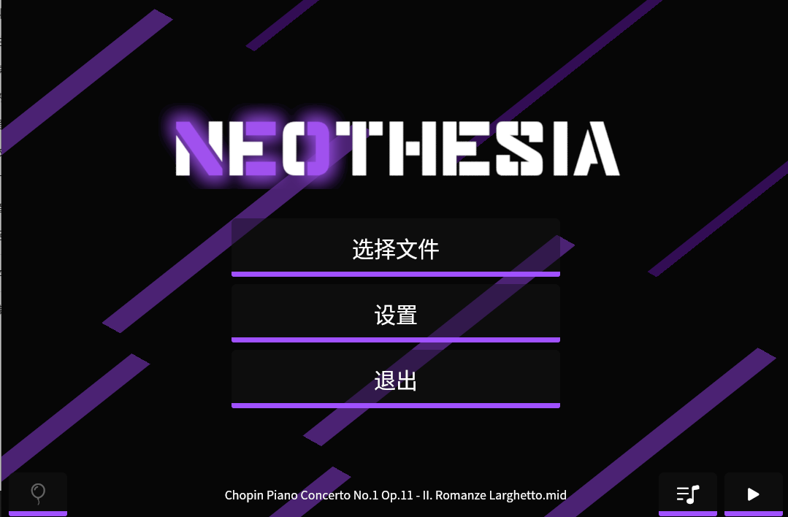
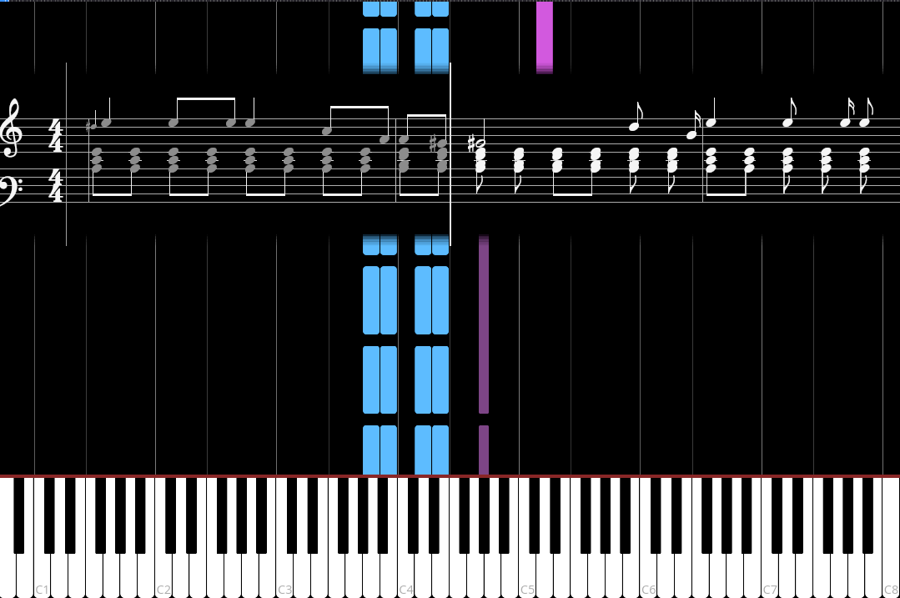

# Neothesia（中文版）

本项目是基于开源项目 **Neothesia** 的汉化与功能改编版本。

## 项目来源

- **上游项目**：[PolyMeilex/Neothesia](https://github.com/PolyMeilex/Neothesia)
- **原作者**：PolyMeilex 及社区贡献者
- **许可证**：GNU General Public License v3.0（GPL-3.0）

Neothesia 是一个用 Rust 编写的跨平台 MIDI 可视化工具（类似开源版的 Synthesia），把 MIDI 文件中的音符显示为虚拟钢琴上落下的彩色方块，帮助用户学习钢琴。

## 快速开始（使用预编译二进制）

仓库 `dist/` 目录下提供了已编译好的可执行文件，无需自行编译，下载后即可运行：

```
dist/
├── linux/
│   ├── neothesia          # Linux x86-64 可执行文件
│   └── default.sf2        # 音源文件（必需）
└── windows/
    ├── neothesia.exe      # Windows x86-64 可执行文件
    ├── default.sf2        # 音源文件（必需）
    └── 使用说明.txt
```

### Linux

```bash
# 1. 赋予执行权限
chmod +x dist/linux/neothesia

# 2. 运行（需把 default.sf2 放在可执行文件同目录，或按提示指定）
./dist/linux/neothesia /path/to/your.mid
```

### Windows

直接双击 `dist/windows/neothesia.exe` 运行，或在命令行：

```cmd
dist\windows\neothesia.exe C:\path\to\your.mid
```

> **注意**：`default.sf2` 音源文件需与可执行文件放在同一目录，否则没有声音。首次打开也可在程序内通过菜单选择 MIDI 文件和音源。

## 改造内容

相对上游版本，本分支主要做了：

- **中文本地化**：界面与说明文档中文化。
- **新增五线谱（staff）预览**：在瀑布画面中加入滚动的大谱表预览，符干跟随声部。
- **完善记谱**：支持符尾连接（beaming）、装饰音（倚音）、八度移位标记（8va/8vb 等）。
- **拍号适配**：小节线按实际拍号计算，兼容 3/4、6/8、2/2 等拍号。

## 界面预览

| 主菜单（中文界面） | 游戏画面（瀑布 + 琴键 + 五线谱预览） |
|--|--|
|  |  |

## 改造执行

本汉化与功能改造工作由 AI 编程助手完成：

- **Claude Code**（Anthropic）
- **ZCode + GLM-5.2**

人工主导需求、验收与决策。

## 自行构建

如需从源码编译，在对应平台执行：

```bash
cargo build --release
```

编译产物位于 `target/release/`。Linux 需 `libasound2-dev`、`libgtk-3-dev` 等系统依赖。

---

# Neothesia

Neothesia is a cross-platform MIDI visualizer build in Rust.
It helps people to quickly learn how to play piano.
It takes music notes from a MIDI file as an input and displays them as colorful falling blocks on a virtual piano.

Opensource Synthesia was abandoned in favour of [closed source commercial project](https://www.synthesiagame.com/)  
The goal of this project is to bring Opensource Synthesia back to life, and make it look and work as good (or even better) than commercial Synthesia.

If you have any questions, feel free to join my Discord

[](https://discord.gg/sgeZuVA)

## Screenshots


[](https://youtu.be/ReE9nVuMCSE)

|||
|--|--|

[Video](https://youtu.be/ReE9nVuMCSE)

## Download

<a href="https://flathub.org/apps/details/com.github.polymeilex.neothesia"></a>

Arch Linux (**Unofficial AUR** built from source, maintained by @zayn7lie): <https://aur.archlinux.org/packages/neothesia>

All binary releases:
[https://github.com/PolyMeilex/Neothesia/releases](https://github.com/PolyMeilex/Neothesia/releases)

## FAQ

- [FAQ](https://polymeilex.github.io/Neothesia/pages/installation.html)
- [Video encoding](https://polymeilex.github.io/Neothesia/pages/video-encoding.html)

## Thanks to

- [WGPU](https://wgpu.rs/)
- [Linthesia](https://github.com/linthesia/linthesia)
- [Synthesia](https://github.com/johndpope/pianogame)
